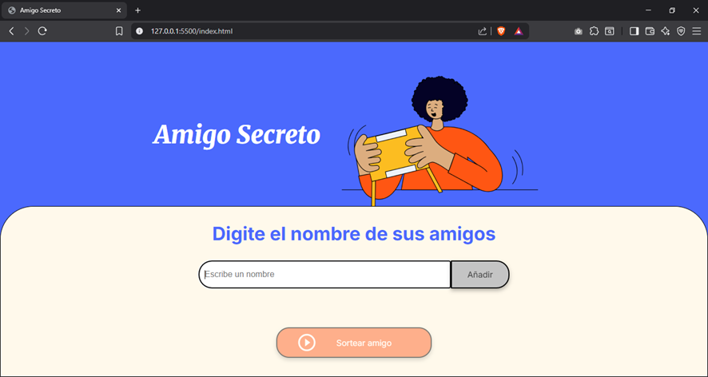
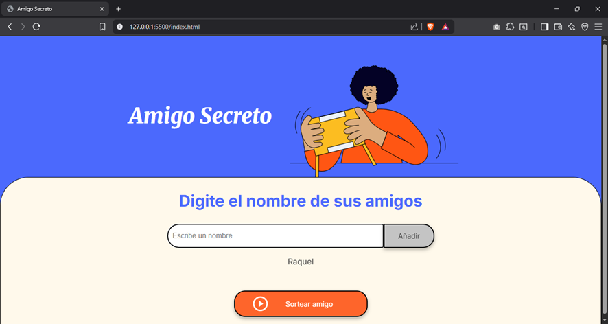
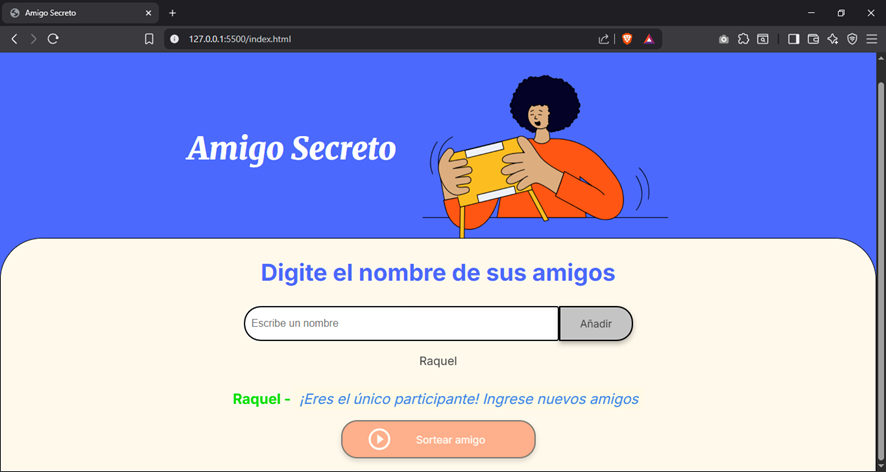
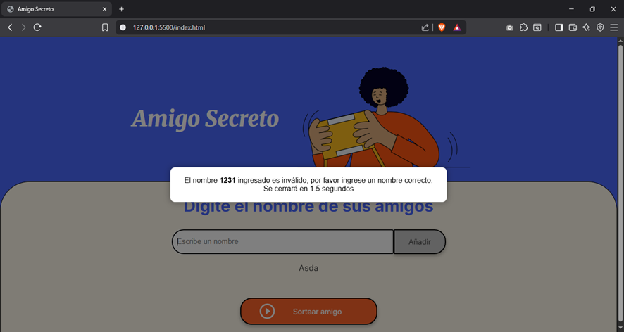
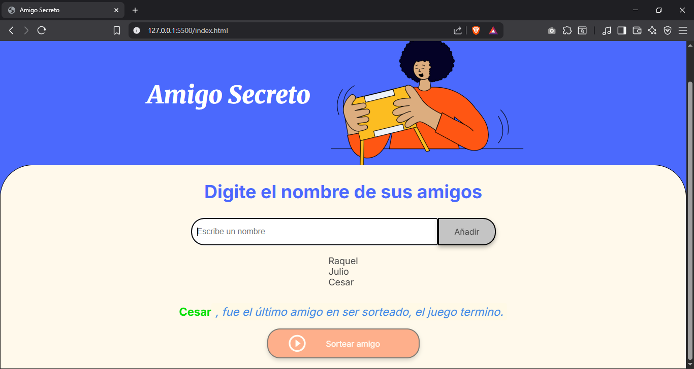

# Juego de Amigo Secreto

## Descripción
Este proyecto es una aplicación web para realizar sorteos de "Amigo Secreto". Permite agregar nombres de participantes, validar entradas para evitar duplicados o nombres inválidos, y realizar sorteos aleatorios hasta que todos los amigos hayan sido seleccionados. Al final del sorteo, la aplicación indica el último amigo sorteado y permite reiniciar el juego para un nuevo ciclo.

El código está escrito en **JavaScript** y utiliza el DOM para actualizar la interfaz de usuario dinámicamente.

---

## Funcionalidades

- Agregar amigos con validación de nombres (solo letras y espacios, mínimo 3 caracteres, máximo 30).  
- Evitar nombres repetidos.  
- Mostrar lista visual de amigos agregados.  
- Sortear un amigo de manera aleatoria y eliminarlo de la lista disponible.  
- Indicar el último amigo sorteado con un mensaje especial.  
- Sistema de alertas personalizadas con temporizador.  
- Reinicio automático o manual del juego para comenzar de nuevo.  

---

## Instalación y Uso

1. Clonar o descargar el repositorio.  
2. Abrir el archivo `index.html` en un navegador web.  
3. Ingresar los nombres de los participantes en el campo de entrada y presionar "Agregar".  
4. Presionar el botón de "Sortear" para seleccionar amigos uno por uno.  
5. Una vez sorteados todos los amigos, se mostrará un mensaje final y el juego se podrá reiniciar para comenzar nuevamente.

---

## Estructura del Código

- **Variables globales:** almacenan los amigos, lista de sorteados y referencias a elementos DOM.  
- **Funciones de inicio y configuración:** establecen condiciones iniciales y valores por defecto.  
- **Funciones de utilidad:** validación de nombres, normalización y capitalización de texto.  
- **Funciones principales:** agregar amigo, mostrar lista, sortear amigos.  
- **Sistema de alertas:** muestra mensajes visuales con temporizador.  
- **Control de interfaz:** habilita/deshabilita botones según el estado del juego.  

---

## Notas

- El proyecto está escrito en JavaScript puro y no requiere librerías externas.  
- Se recomienda utilizar un navegador moderno para un mejor rendimiento de la interfaz.  
- El código está documentado con comentarios para facilitar su comprensión y mantenimiento.

---

## Algunas Capturas

- Cuando solo hay un nombre.

- Cuando ingresa un nombre incorrecto realiza validaciondes de nombre vacio, numeros o simbolos que no son correctos. Tambien realiza una normalizacion de nombres.

- Cuando sortea el nombre final.

---

